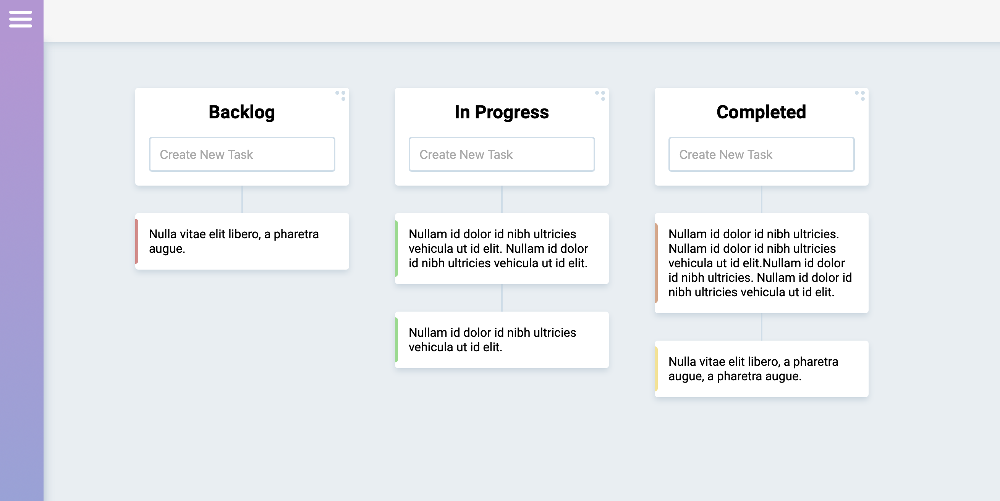

CSS: ../style.css

{{../header.md}}

Coding / Kanban

---

[Demo](https://kanban-proj.netlify.app/) - [Github](https://github.com/acekreations/kanban)

## Summary

This project is a Trello style kanban board using only the HTML5 drag and drop spec. There are tons of javascript libraries built for drag and drop functionality but I wanted to build this project to try out the HTML5 drag and drop and see if those libraries are a thing of the past.

## Difficulties

The HTML drag and drop API itself is actually much simpler than I would have expected, it only has 8 events and can be initiated with just a couple lines of JS and a couple HTML attributes, but with simplicity comes limitation. The difficulties I faced on this project weren’t so much in figuring out how to make the tech work but really in figuring out what the tech was not capable of.

Don’t get me wrong, in terms of pure functionality I believe HTML drag and drop can do everything you need. But what it can’t do is those little extra things like having a drag state, or animations, that make the users life a little nicer.

## Tech

- React
- HTML5 Drag and Drop API

{{../footer.md}}
